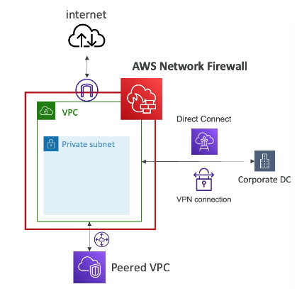
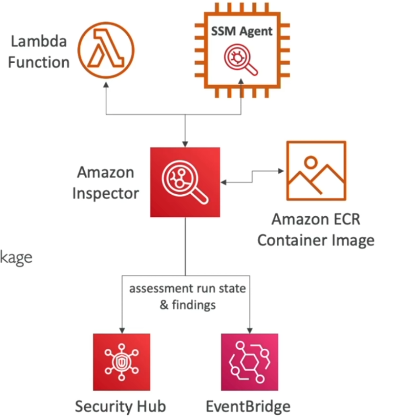

**Shared Responsibilities**

AWS Shared Responsibility Model => **Security of the Cloud**

S3, DynamoDB, RDS

Customer Responsibility => **Security in the Cloud**

Firewall & N/W configuration, IAM, Encryption

Shared Controls:

Patch Management, Configuration Management, Awareness & Training

Responsibilities in RDS:

**AWS:**

Manage underlying EC2, disable SSH access

Automated DB & OS patching

Audit underlying instance & disks & guarantee it functions

**Customer Responsibility:**

Ports / IP / SG inbound rules

In-database user creation & permissions

Public access for databases

Parameter groups or DB is configured to only allow SSL connections

DB encryption

Responsibilities in S3:

AWS:

Unlimited storage

Guarantee you get encryption

Ensure separation of the data between different customers

Ensure AWS employees can’t access your data

Customer Responsibility:

Bucket configuration

Bucket Policy

IAM user & roles

Enabling Encryption

**DDOS Attack (Distributed Denial of Service)**

A diagram of a program

AI-generated content may be incorrect.

Normal users can’t access as many bots are requesting our application server

**AWS protects DDOS Attacks**

AWS Shield Standard (Free)

AWS Shield Advanced (Premium)

AWS WAF (Filter requests based on rules)

CloudFront & Route53 (Protection using global edge N/W)

AWS Auto Scaling

**WAF => Web Application Firewall**

A diagram of a security system

AI-generated content may be incorrect.

AWS Shield Standard: Provides from attacks such as SYN/UDP floods, Reflection attacks & other layer3 / layer4 (TCP) attacks

AWS Shield Advanced: Amazon EC2, ELB, Amazon CloudFront, AWS Global Accelerator, Route53

AWS WAF: Protects from layer7 attacks (HTTP), it is deployed on ALB, API Gateway, CloudFront

Web ACL (Web Access Control List): Rules can include IP addresses, HTTP headers, HTTP body, or URI strings

Protects from SQL Injections, Cross-Site Scripting (XSS), Geo-match (block specific countries), Rate-based rules (to count occurrences of events)

**AWS N/W Firewall:**

Protect entire Amazon VPC

From layer3 to layer7 protection

VPC to VPC traffic, Outbound to internet, Inbound from internet, To/from Direct Connect & Site-to-Site VPN

**Note:** 

N/W ACL => Subnet Level

N/W Firewall => VPC level

A diagram of a network firewall

AI-generated content may be incorrect.

**AWS Firewall Manager:**

Manages security rules in all accounts of an AWS Organization

**Amazon GuardDuty:**

Intelligent Threat discovery to protect your AWS Account

Uses ML algos, anomaly detection, 3rd party data

Protects against Crypto Currency attacks

**Amazon Inspector:**

Automated Security Assessments

Reporting & integration with AWS Security Hub

Send findings to Amazon Event Bridge

A diagram of a company

AI-generated content may be incorrect.

**Inspector only for EC2, Container Images, Lambda funxctions**

**AWS Config Overview:**

Record configurations & changes over time

Storing configuration data into S3 (analysed by Athena)

Receive alerts (SNS notifications) for any changes

Per-region service

Can be aggregated across regions & accounts

View CloudTrail API calls if enabled

**Amazon Macie**

Data security and data privacy service that uses ML & Pattern matching too discover and protect your sensitive data in AWS

Macie helps identify and alert you to sensitive data, such as PII data

Notifies Event Bridge to do some integrations 

**AWS Security Hub Overview:**

Manage Security across AWS accounts and automate security checks

Must first enable AWS Config Service

A diagram of a multi account

AI-generated content may be incorrect.

**Amazon Detective Overview:**

Finds root cause of security issues using ML & graphs

Automatically collects & processes events from VPC flow logs, CloudTrail, GuardDuty

**Root User Privileges:**

Root User = Account Owner

Has complete access

**Lock away** your AWS account root user **access Keys**

Change account settings

Close your AWS account

Register as a seller in the Reserved Instance Marketplace

**IAM Access Analyzer:**

Find out which resources are shared externally

Zone of trust = AWS Account or AWS Organization

Access outside zone of trusts = findings

**Amazon Rekognition:**

For faces, objects, etc from Images/Videos

**Amazon Transcribe:**

Convert speech to text

ASR (Automatic Speech Recognition)

Automatically remove PII data using **Redaction**

Automatic Language Identification for multi-lingual audio

Use cases: Customer service calls transcribe, closed captioning & subtitling, generate metadata for media assets

**Polly Overview:**

Text to speech

Create applications that talk

**Translate Overview:**

Natural & accurate language translation

**Lex + Connect Overview:**

Amazon Lex => tech that powers Alexa

ASR to convert speech to text

Helps build chatbots, call center bots

Amazon Connect:

Receives calls, create **contact flows**, cloud based **virtual contact center**

Can integrate with other CRM systems or AWS

**Comprehend Overview:**

For NLP

Fully managed & serverless service

Language of the text, sentiment analysis, POS & tokenization, organizes a collection of text files

Analyze customer interactions/emails

Create & group articles by topics

**SageMaker Overview:**

Fully managed service for developers / data scientists to build ML models

**Kendra Overview:**

Document search service (Search Engine)

Extract answers from within a document

**Amazon Personalize:**

For real-time personalized recommendations

Retail stores, media & entertainment

**Textract Overview:**

Extracts text, handwriting, and data from any scanned docs using AI & ML

Extracts data from forms & tables

Read & Process any type of document (PDFs, images…)

Use cases: Financial Services, Healthcare, Public Sector

**AWS Organizations Units (OUs)**

Global Service

Multiple AWS accounts can be managed

Consolidated Billing, pricing benefits, pooling of reserved EC2 instances

API available to automate AWS account creation

Restrict account privileges using **Service Control Policies (SCP)**

Multi Account vs One Account Multi VPC

Tagging Standards for billing purposes

Enable CloudTrail on all accounts, send logs to central S3 account

Send CloudWatch logs to central logging account

SCPs doesn’t apply to the master account

SCPs applied to all Users & Roles of the Account including Root

SCP doesn’t affect service-linked roles

SCP must have an explicit Allow (doesn’t allow anything by default)

Restrict access to certain services

Explicitly disable services

**Control Tower** => to setup multiple accounts

**AWS RAM (Resource Access Manager)**

Share AWS resources that you own with other AWS accounts

Share with any account or within your organisation

Avoid resource duplication

Aurora, VPC Subnets, Transit Gateway, Route 53, EC2 Dedicated Hosts, License Manager Configurations… all support RAM

**AWS Service Catalog:**

Self service portal to launch a set of authorized products pre-defined by admins

Includes: VMs, DBs, storage options, etc

Enter AWS Service Catalog!

Service Catalog Diagram

A diagram of a product

AI-generated content may be incorrect.

**Pricing Models in AWS:**

1) Pay as you go
1) Save when you reserve
1) Pay less by using more
1) Pay less as AWS grows

**Free Services & Free Tier in AWS**

IAM, VPC, Consolidated Billing, Elastic Beanstalk, CloudFormation, Auto Scaling Groups

Free tier: EC2 t2.micro instance for a year, S3, EBS, ELB, AWS Data transfer

**Compute Pricing EC2**

Only charged for what you use

Number of instances

Instance Configuration

ELB running time & amount of data processed

Detailed monitoring

EC2:

1) On-demand instances
1) Reserved instances (1-3 years commitment)
1) Spot instances
1) Dedicated Host
1) Savings plans

Lambda & ECS:

Lambda: Pay per call, Pay per duration

ECS: EC2 Launch Type => No additional fees, you pay for AWS resources 

`		`Fargate=> Pay for vCPU & memory resources allocated to your applications in your containers

S3:

Storage class

Number & size of objects

Number & type of requests

Data transfer out of S3 region

S3 Transfer acceleration

Lifecycle transitions

Similar Service: EFS (pay per use)

EBS:

Volume type

Storage volume in GB per month provisioned

IOPS: General Purpose, Provisioned IOPS SSD, Magnetic

Snapshots

Data transfer: Outbound data transfer are tiered for volume discounts, Inbound is free

RDS:

Per hour billing

Database characteristics

Purchase type

Backup Storage: No additional charge for backup storage up to 100% of your total DB storage for a region

Additional Storage

No of input & output requests per month

Deployment types (single or multi AZs)

Data transfer (Outbound data transfer are tiered for volume discounts), Inbound is free

CloudFront:

Different geographic regions

Aggregated for each edge location

Data transfer out

No of HTTP/HTTPS requests

**Networking Costs in AWS per GB:**

A diagram of a network

AI-generated content may be incorrect.

Use Private IP instead of public IP for good savings & better N/W performance

Use same AZ for max savings (at the cost of high availability)

**Savings Plan Overview:**

Commit a certain amount per hour for 1 or 3 years

**EC2 Savings Plan:**

Commit to usage of individual instance families in a region

All upfront, partial upfront, no upfront

**Compute Savings Plan:**

Regardless of family, region, size, OS, tenancy, compute options

EC2, Fargate, Lambda

**Machine Learning Savings Plan:**

SageMaker

**AWS Compute Optimizer Overview:**

Reduce costs & improve performance by recommending optimal AWS resources

Uses ML to analyze your resources configs & their utilization CloudWatch metrics

Supported resources:

EC2 instances, EC2 ASGs, EBS Volumes, Lambda functions

Recommendations can be exported to S3

**Billing & Costing Tools:**

1) Estimating costs in the cloud: Pricing calculator
1) Tracking costs in the cloud: Billing dashboard, cost allocation tags, cost & usage reports, cost explorer
1) Monitoring against costs plans: billing alarms, budgets

**Pricing Calculator:**

Estimate cost for your solution architecture

**AWS Billing Dashboard**

Cost breakdown by month by service by region by account, etc

**Cost Allocation Tags:**

To track your AWS costs on a detailed level

AWS generated tags: automatically applied to resource you create (**aws:** createdBy)

User generated tags: Defined by the user (**user:**)

**Tagging & Resource Groups:**

Tags => used for organizing resources

EC2: instances, images, load balancers, security groups

RDS, VPC resources, Route 53, IAM users

Resources created by CloudFormation are all tagged the same way

Free naming, common tags are: **Name, Environment, Team**

Tags can be used to create **Resource groups**

Create, maintain, and view a collection of resources that share common tags

Manage these tags using the Tag Editor

**Cost & Usage Reports:**

Dive deeper into your AWS costs & usage

The AWS cost & usage report contains the most comprehensive set of AWS cost & usage data available, including additional metadata about AWS services, pricing & reservations (eg. Amazon EC2 Reserved Instances (RIs))

Can be integrated with Athena, Redshift or QuickSight

**Cost Explorer:**

Forecast usage up to 12 months based on previous usage

Visualize, understand and manage your AWS costs & usage over time

Analyze data at high level

Monthly, Hourly, Resource level granularity

Choose an optimal Savings Plan

**Billing Alarms in CloudWatch**

Stored in CloudWatch us-east-1

For overall worldwide AWS costs

For actual cost, not for projected costs

Intended a simple alarm (not as powerful as AWS Budgets)

**AWS Budgets:**

Create budget & send alarms when cost exceeds the budget

4 types: Usage, Cost, Reservation, Savings Plan

For Reserved Instance (RI): Track utilization, Supports EC2, ElastiCache, RDS, RedShift

Up to 5 SNS notifications per budget

Can filter by: Service, Linked Account Tag, Purchase Option, Instance Type, Region, AZ, API Operation, etc

Same options as AWS Cost Explorer!

**AWS Cost Anomaly Detection:**

Continuously monitor your cost & usage using ML to detect unusual spends

Sends you anomaly detection report with RCA (root cause analysis)

Can notify you in case of anomalies

**AWS Service Quotas:**

Notify you when you’re close to a service quota value threshold

Create CloudWatch Alarms on the Service Quotas console

Eg: Lambda concurrent executions

Request a quota increase from AWS Service Quota or shutdown resources before limit is reached

**AWS Trusted Advisor:**

High level AWS account assessment

6 Categories:

Cost optimization, Performance, Security, Fault tolerance, Service limits, Operational Excellence

Security checks alone are free, others are paid

Business & Enterprise Support plan:

Full set of checks

Programmatic Access using **AWS Support API**

**Support Plans for AWS**

Basic Support: free

4 types: Developer, Business, Enterprise On-Ramp, Enterprise

Basic: 24x7 access to customer service alone, access to 7 core trusted advisor checks, Personal health dashboard

Developer: Basic + Business hours email address, Unlimited cases/contacts, within 12 business hours

Business: if you have production workloads, Trusted Advisor: Full set of checks + API access, 24x7 phone, email & chat access, Unlimited cases/contacts, access to Infrastructure Event Management for additional fee, if prod system impaired < 4 hours, if prod system down < 1 hour

On-Ramp: Business + Pool of TAM (Technical Account Managers), Concierge Support team, Infrastructure Event Management, Well Architected & Operations Reviews,Case severity/ response times: prod impaired < 4 hours, prod system down < 1hour, Business critical system down < 30 minutes

Enterprise: On-Ramp + designated TAM, AWS Incident Detection & Response, Business critical system down < 15 minutes

**Account Best Practices:**

AWS Organizations

SCP (Service Control Polices)

AWS Control Tower

Use Tags & Cost Allocation Tags

IAM guidelines

Config to record all resources configurations

CloudFormation to deploy stacks across accounts & regions

Trusted Advisor to get insights, Support Plan

Send Service logs & Access logs to S3 or CloudWatch logs

CloudTrail to record API calls

AWS Service Catalog for predefined stacks defined by Admin

**Billing Summary:**

Compute Optimizer

Pricing Calculator

Billing Dashboard

Cost Allocation tags

Cost & Usage Reports

Cost Explorer

Billing Alarms

Budgets

Savings Plans

Cost Anomaly detection

Service Quotas

**AWS STS (Security Token Service)**

Temporary security credentials to access AWS resources

Short term credentials: you can configure expirations as well

Use cases: Identity federation, IAM roles for cross/same account access, IAM Roles for Amazon EC2 (provide temporary credentials for EC2 instances to access AWS resources)

**Amazon Cognito**

Identify for your Web & Mobile Applications users (potentially millions)

Instead of creating them an IAM user, you create a user in Cognito

A diagram of a computer process

AI-generated content may be incorrect.

**Microsoft Active Directory (AD) Services:**

Found on any Windows Server with AD Domain Services

Database of objects: User Accounts, Computers, Printers, File Shares, Security Groups

Centralized Security Management, Create Account, Assign Permissions

**AWS Directory Services:**

AWS Managed Microsoft AD – Create your own AD in AWS, manage users locally, supports MFA. Establish trust connections with your on-premises AD

AD Connector – Directory Gateway (proxy) to redirect to on-premises AD, supports MFA. Users managed on the on-premises AD

Simple AD – AD compatible managed directory on AWS. Can’t be joined with on-premises AD

**AWS IAM Identity Center / AWS SSO (Single Sign-On):**

One login for all your

1)AWS accounts in AWS Organizations

2)Business cloud applications

3)SAML2.0 enabled applications

4)EC2 windows instances

Identity providers

Built-in identity store in IAM Identity Center

3rd party: AD, OneLogin, Okta…

**Advanced Identity Summary:**

IAM (inside AWS accounts) – for users that you trust and belong to your company

Organizations: manage multiple accounts

STS: temporary, limited-priveleges, creds to access AWS resources

Cognito: create a database of users for your mobile & web applications

Directory Services: integrate Microsoft Active Directory in AWS

IAM Identity Center: one login for multiple AWS Accounts & business applications

**Other Services:**

**AWS Workspaces:**

Managed Desktop as a Service (DaaS) solution to easily provision Windows or Linux desktops

Great to eliminate management of on-premises VDI (Virtual Desktop Infrastructure)

Fast and quickly scalable to thousands of users

Secured data – integrates with KMS

Pay-as-you-go service with monthly or hourly rates

Deploy the Workspaces closer to users to reduce the latency across the regions

**AppStream 2.0 Overview:**

Desktop Application Streaming Service

Deliver to any computer, without acquiring, provisioning infrastructure

The application is delivered from within a web browser

AppStream vs Workspace

Workspaces => fully managed VDI & desktop available, Users connect to VDI & open native or WAM applications, Workspaces are on-demand or always on

AppStream 2.0 => Stream a desktop application to web browsers (no need to connect to VDI), Works with any device (that has a web browser), Allow to configure an instance type per application type (CPU, RAM, GPU)

**AWS IoT Core Overview:**

N/W of internet connected devices that are able to collect & transfer data

Easily connect IoT devices to AWS cloud

Serverless, secure & scalable to billions & trillions of messages

Applications can communicate with your devices even when they aren’t connected

Integrates with a lot of AWS services (Lambda, S3, SageMaker, etc)

Build IoT applications that gather, process, analyze and act on data

**Amazon Elastic Transcoder:**

To convert media files stored in S3 into media files in the formats required by consumer playback devices (phones, etc)

Easy to use

Highly scalable

Cost effective – duration based pricing model

Fully managed & secure

Pay for what you use

**AWS AppSync:**

Store & sync data across mobile & web apps in real time

Makes use of GraphQL (mobile technology from Facebook)

Client code can be generated automatically

Integrations with DynamoDB, Lambda

Real-time subscriptions

Offline **data synchronization** (**replaces Cognito Sync**)

Fine Grained Security

**AWS Amplify** can leverage AWS AppSync in the background!

**AWS Amplify:**

A set of tools & services that helps you develop and deploy scalable full stack web & mobile applications

Authentication, Storage API (REST, GraphQL), CI/CD, PubSub, Analytics, AI/ML predictions, Monitoring, Source Code from AWS, GitHub, etc

Amplify Backend: S3, Cognito, AppSync, API Gateway, SageMaker, Lex, Lambda, DynamoDB

**AWS Infrastructure Composer:**

Visually design & build serverless applications quickly on AWS

Configure how your resources interact with each other

Generates Infrastructure as Code (IaC) using CloudFormation

Ability to import existing CloudFormation / SAM templates to visualize them

**AWS Device Farm:**

Fully managed service that tests your web and mobile apps against desktop browsers, real mobile devices, and tablets

Run tests concurrently on mobile devices (speed up execution)

Ability to configure device settings (GPS, language, Wi-Fi, Bluetooth)

Test application (web, native, hybrid)

Interact with devices

Reports, logs and screenshots

**AWS Backup Overview:**

Fully managed service to centrally manage & automate backups across AWS services

On-demand & scheduled backups

Supports PITR (Point-in-time Recovery)

Retention Periods, Lifecycle Management, Backup Policies

Cross-Region Backup

Cross-Account Backup (using AWS Organizations)

**Disaster Recovery Strategies:**

Backup & Restore (Cheapest)

Pilot Light (Core functions of the app)

Warm Standby (Full version of the app but at minimum size)

Multi-Site/Hot-Site (Full version of the app at full size)

**AWS Elastic Disaster Recovery (DRS):**

Quickly & easily recover your physical, virtual & cloud-based servers into AWS

Example: protect your most critical databases (including Oracle, MySQL, and SQL Server), enterprise apps (SAP), protect your data from ransomware attacks

Continuous block-level replication for your servers

A diagram of a cloud

AI-generated content may be incorrect.

**AWS DataSync:**

Move large amount of data from on-premises to AWS

Can synchronize to: S3, EFS, FSx for Windows

Replication tasks can be scheduled hourly, daily, weekly

The replication tasks are incremental after the first full load

**Cloud Migration Strategies – 7Rs:**

Retire = turn off things you don’t  need, helps reducing areas of attacks, Saves cost, focus on resources that must be maintained

Retain = Do nothing for now, security, data compliance, performance, unresolved dependencies, No business value to migrate, mainframe or mid-range and non-x86 Unix apps

Relocate = Move apps from on-premises to its cloud version, move EC2 instances to a different VPC, AWS Account or AWS Region

Rehost “lift” and “shift” = Simple migrations by re-hosting on AWS (applications, databases, data…), Migrate machines, No cloud optimizations being done, could save 30% on cost, Migrate using AWS Application Migration Service

Replatform “lift” and “reshape” = Migrate your DBs to RDS, migrate your application to EBS, Not changing your architecture, but leverage some cloud optimizations, Save time & money by moving to a fully managed service or Serverless

Repurchase “drop” and “shop” = Moving to a different product while moving to the Cloud, Often you move to a SaaS platform, Expensvie in the short term, but quick to deploy, CRM to Salesforce.com, HR to Workday, CMS to Drupal

Refactor/Re-architect = Reimagining how the application is architected using Cloud native features, driven by the need of the business to add features and improve scalability, performance, security and agility, Move from a monolithic application to micro-services, Move an application to serverless architectures, use AWS S3

**Application Discovery Service:**

Plan migration projects by gathering information about on-premises data centers

Server utilization data and dependency mapping are important for migrations

**Agentless Discovery (AWS Agentless Discovery Connector)**

VM inventory, configuration, and performance history such as CPU, memory, and disk usage

**Agent-based Discovery (AWS Application Discovery Agent)**

System configuration, system performance, running processes and details of the network connections between systems

Resulting data can be viewed within AWS Migration Hub

**AWS Application Migration Service (MGN):**

Lift and shift (Rehost) solution which simplify migrating applications to AWS

Converts your physical, virtual, and cloud-based servers to run natively on AWS

Supports wide range of platforms, OS and databases

Minimal downtime, reduced costs

**AWS Migration Evaluator:**

To build data-driven business case for migration to AWS

Provides a clear baseline of what your organization is running today

Install Agentless Collector to conduct broad-based discovery

Take a snapshot of on-premises foot-print, server dependencies

Analyze current state, define target state, then develop migration plan

**AWS Migration Hub:**

Central location to collect servers and applications inventory data for the assessment, planning and tracking of migrations to AWS

Helps accelerate your migration to AWS, automate lift & shift

AWS Migration Hub Orchestrator – provides pre-built templates to save time & effort migrating enterprise apps (eg. SAP, Microsoft SQL Server)

Supports migrations status updates from Application Migration Service (MGN) & Database Migration Service (DMS)

A close-up of a screen

AI-generated content may be incorrect.

**AWS Fault Injection Simulator (FIS):**

Fully managed service for running fault injection experiments on AWS workloads

Based on Chaos Engineering – stressing an application by creating disruptive events observing how the system responds and implementing improvements

Helps you uncover hidden bugs and performance bottlenecks

Supports EC2, EKS, ECS, RDS

Use pre-built templates that generate the desired disruptions

**AWS Step Functions:**

Build serverless visual workflow to orchestrate your Lambda functions

Features: sequence, parallel, conditions, timeouts, error handling

Can integrate with EC2, ECS, on-premises servers, API Gateway, SQS Queues

Possibility of implementing human approval features

Use cases: order fulfilment, data processing, web applications, any workflow

**AWS Ground Station:**

Fully managed service that lets you control satellite communications, process data and scale your satellite operations

Provides a global network of satellite ground stations near AWS regions

Allows you to download satellite data to your AWS VPC within seconds

Send satellite data to S3 or EC2 instance

Use cases: Weather forecasting, surface imaging, communications, video broadcasting

**AWS Pinpoint:**

Scalable 2-way (outbound/inbound) marketing communications service

Supports email, SMS, push, voice & in-app messaging

Ability to segment & personalize messages with the right content to customers

Possibility to receive replies

Scales to billions of messages per day

Use cases: run campaigns by sending marketing, bulk, transactional SMS messages

**Versus Amazon SNS or Amazon SES:**

In SNS & SES, you managed each message’s audience, content and delivery schedule

In Amazon pinpoint, you create message templates, delivery schedules, highly targeted segments and full campaigns

